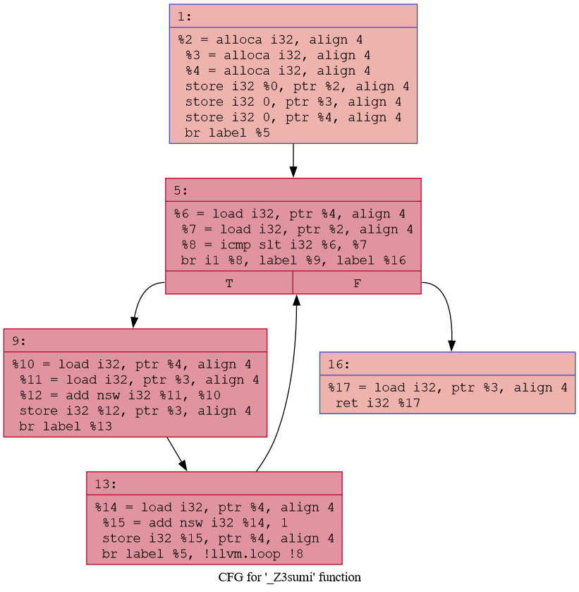

# LLVM Control Flow Analysis

## Overview

This exercise explores how LLVM IR represents control flow constructs such as conditionals and loops. The key LLVM instructions studied are:

- `icmp` – comparison instruction
- `br` – branch instruction
- `phi` – SSA merge instruction
- Basic Blocks – units of execution flow

---

# Task 1 - Conditionals

## Source Code

```cpp
int check(int x)
{
    if (x > 5)
        return 1;
    else
        return 0;
}
```

---

## Generated LLVM IR (Relevant Excerpt)

```llvm
%4 = load i32, ptr %3, align 4
%5 = icmp sgt i32 %4, 5
br i1 %5, label %6, label %7

6:
  store i32 1, ptr %2, align 4
  br label %8

7:
  store i32 0, ptr %2, align 4
  br label %8

8:
  %9 = load i32, ptr %2, align 4
  ret i32 %9
```

---

## Analysis

### icmp Instruction

```llvm
%5 = icmp sgt i32 %4, 5
```

- `icmp` stands for Integer Compare.
- `sgt` means Signed Greater Than.
- LLVM compares the value of `x` with `5`.
- The result is a boolean value (`true` or `false`).

Equivalent C++:

```cpp
x > 5
```

---

### br Instruction

```llvm
br i1 %5, label %6, label %7
```

- `br` stands for Branch.
- If `%5` is true, execution jumps to block `%6`.
- If `%5` is false, execution jumps to block `%7`.

Equivalent C++:

```cpp
if(x > 5)
{
    return 1;
}
else
{
    return 0;
}
```

---

### Basic Blocks

LLVM divides the program into several blocks:

#### Entry Block

```llvm
%4 = load i32, ptr %3
%5 = icmp sgt i32 %4, 5
br i1 %5, label %6, label %7
```

Responsible for evaluating the condition.

---

#### True Block (%6)

```llvm
store i32 1, ptr %2
br label %8
```

Executed when:

```cpp
x > 5
```

---

#### False Block (%7)

```llvm
store i32 0, ptr %2
br label %8
```

Executed when:

```cpp
x <= 5
```

---

#### Merge Block (%8)

```llvm
%9 = load i32, ptr %2
ret i32 %9
```

Both branches converge here before returning.

---

## Answers

### How is x > 5 checked?

LLVM uses:

```llvm
icmp sgt i32 %4, 5
```

which performs a signed greater-than comparison.

---

### How is the if/else structure implemented?

LLVM uses a conditional branch instruction:

```llvm
br i1 %5, label %6, label %7
```

to jump to either the true block or the false block.

---

### How does LLVM determine which return value to use?

Each branch stores a different value (`1` or `0`) into memory. Both branches then jump to a common merge block where the stored value is loaded and returned.

---

# Task 2 - Loops

## Source Code

```cpp
int sum(int n)
{
    int s = 0;

    for(int i = 0; i < n; ++i)
    {
        s += i;
    }

    return s;
}
```

---

## Generated LLVM IR (Relevant Excerpt)

```llvm
store i32 0, ptr %3
store i32 0, ptr %4
br label %5

5:
  %6 = load i32, ptr %4
  %7 = load i32, ptr %2
  %8 = icmp slt i32 %6, %7
  br i1 %8, label %9, label %16

9:
  %10 = load i32, ptr %4
  %11 = load i32, ptr %3
  %12 = add nsw i32 %11, %10
  store i32 %12, ptr %3
  br label %13

13:
  %14 = load i32, ptr %4
  %15 = add nsw i32 %14, 1
  store i32 %15, ptr %4
  br label %5

16:
  %17 = load i32, ptr %3
  ret i32 %17
```

---

## Analysis

### Loop Entry Block

```llvm
store i32 0, ptr %3
store i32 0, ptr %4
br label %5
```

Initializes:

```cpp
s = 0;
i = 0;
```

Then transfers control to the loop condition block.

---

### Loop Condition Block

```llvm
5:
  %6 = load i32, ptr %4
  %7 = load i32, ptr %2
  %8 = icmp slt i32 %6, %7
  br i1 %8, label %9, label %16
```

Equivalent C++:

```cpp
if(i < n)
{
    goto loop_body;
}
else
{
    goto exit;
}
```

---

### Loop Body Block

```llvm
9:
  %10 = load i32, ptr %4
  %11 = load i32, ptr %3
  %12 = add nsw i32 %11, %10
  store i32 %12, ptr %3
```

Equivalent C++:

```cpp
s += i;
```

---

### Increment Block

```llvm
13:
  %14 = load i32, ptr %4
  %15 = add nsw i32 %14, 1
  store i32 %15, ptr %4
  br label %5
```

Equivalent C++:

```cpp
++i;
```

Then execution jumps back to the condition block.

---

### Exit Block

```llvm
16:
  %17 = load i32, ptr %3
  ret i32 %17
```

Equivalent C++:

```cpp
return s;
```

---

## Loop Control Flow

```text
Entry
  |
  v
Condition (i < n)
  | true
  v
Body
  |
  v
Increment
  |
  +--------+
           |
           v
      Condition

Condition
  | false
  v
Exit
```

---

## Answers

### What role does the phi node play?

A `phi` node is used in SSA (Static Single Assignment) form to select a value based on the control-flow path taken to reach a block.

Example:

```llvm
%i = phi i32 [0, %entry], [%next, %loop]
```

It allows LLVM to merge values coming from different predecessor blocks.

---

### How does LLVM remember the loop variable i across iterations?

In this IR, compiled with:

```bash
clang++ -O0
```

LLVM does not use SSA variables. Instead, it stores the loop variable in memory using:

```llvm
alloca
load
store
```

The current value of `i` is loaded, incremented, stored back, and reused in the next iteration.

---

### How is the loop exit condition implemented?

LLVM uses:

```llvm
%8 = icmp slt i32 %6, %7
```

to evaluate:

```cpp
i < n
```

Then:

```llvm
br i1 %8, label %9, label %16
```

decides whether to continue the loop or exit.

---

## Note About Phi Nodes

The assignment asks to identify a phi node.

However, the generated IR was compiled with:

```bash
clang++ -O0 -S -emit-llvm
```

At optimization level `-O0`, LLVM keeps variables in memory and therefore does not generate phi nodes.

Instead, variable updates are represented through:

```llvm
alloca
load
store
```

instructions.

Phi nodes typically appear after optimization passes or memory-to-register promotion (`mem2reg`).

---

# Task 3 - Control Flow Graph (CFG)

## CFG Generation

LLVM CFG was generated using:

```bash
opt -passes=dot-cfg -disable-output ir/loop.ll
```

A DOT file was produced and converted into PNG format:

```bash
dot -Tpng ._Z3sumi.dot -o loop_cfg.png
```

---

## CFG Block Labels

### Entry Block

Initializes variables.

### Condition Block

Checks:

```cpp
i < n
```

### Loop Body

Performs:

```cpp
s += i;
```

### Increment Block

Performs:

```cpp
++i;
```

### Exit Block

Returns the accumulated sum.

---

## CFG Diagram

Insert the generated image below:



---

# Summary

## icmp

Used for comparisons:

```llvm
icmp sgt
icmp slt
icmp eq
icmp ne
```

Examples:

```cpp
>
<
==
!=
>=
<=
```

---

## br

Used for control flow.

### Conditional Branch

```llvm
br i1 %cond, label %true, label %false
```

Equivalent to:

```cpp
if(condition)
```

---

### Unconditional Branch

```llvm
br label %target
```

Equivalent to:

```cpp
goto target;
```

---

## phi

Used in SSA form to merge values from different control-flow paths.

Example:

```llvm
%x = phi i32 [1, %A], [2, %B]
```

If execution came from block `A`, `%x` becomes `1`.

If execution came from block `B`, `%x` becomes `2`.

Phi nodes are commonly used in loops and merge blocks.

---

## Conclusion

This exercise demonstrated how LLVM IR represents high-level control-flow constructs using:

- `icmp` for comparisons
- `br` for branching
- Basic blocks for execution flow
- `phi` nodes for SSA value merging

Conditionals and loops are transformed into low-level branch-based control flow, enabling LLVM to perform analysis and optimization independent of the source language.